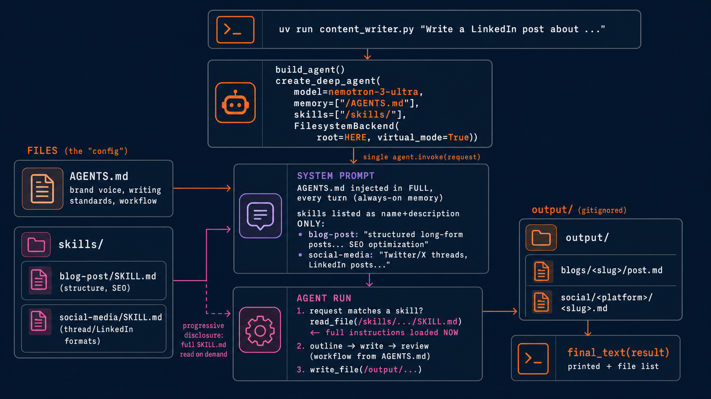

# Content Writer with Nemotron 3 Ultra

A configurable content-writing agent (blog posts, LinkedIn posts, Twitter/X threads) built with
[NVIDIA Nemotron 3 Ultra](https://api.together.ai/models/nvidia/nemotron-3-ultra-550b-a55b),
running on Together AI via [LangChain Deep Agents](https://github.com/langchain-ai/deepagents).

This cookbook demonstrates how to separate reusable writing expertise from application logic
using Deep Agents' memory and skills architecture. Instead of modifying code, you can
customize agent behavior by editing markdown-based memory and skill files.

Ported from [`deepagents/examples/deploy-content-writer`](https://github.com/langchain-ai/deepagents/tree/main/examples/deploy-content-writer).

## What you'll learn

In this cookbook you'll learn how to:

- Build a configurable content-writing agent with LangChain Deep Agents
- Customize agent behavior through memory and skills files
- Run NVIDIA Nemotron 3 Ultra on Together AI
- Separate reusable expertise from application logic

## How it's configured (files, not code)



The agent's behavior is defined through configuration files rather than application code.
This makes it easy to customize writing style, workflows, and reusable expertise without
modifying the underlying implementation.

The agent's behavior lives in plain files, loaded by the Deep Agents harness:

- **`AGENTS.md`** — always-on memory: brand voice, writing standards, content
  pillars, workflow. Injected into the system prompt every turn.
- **`skills/blog-post/SKILL.md`**, **`skills/social-media/SKILL.md`** —
  progressive disclosure: the model sees only each skill's name + description
  and reads the full file when the request matches. Edit these files to change
  the agent — no code changes needed.

`content_writer.py` is just ~30 lines of wiring:

```python
create_deep_agent(
    model="together:nvidia/nemotron-3-ultra-550b-a55b",
    memory=["/AGENTS.md"],
    skills=["/skills/"],
    backend=FilesystemBackend(root_dir=str(HERE), virtual_mode=True),
)
```

## Run it

```bash
export TOGETHER_API_KEY=...

# with uv (dependencies resolve automatically from the script header)
uv run content_writer.py "Write a LinkedIn post about why open-weight models matter for enterprises"
uv run content_writer.py "Write a blog post about prompt caching"

# or with pip
pip install "deepagents>=0.6,<0.8" langchain-together
python content_writer.py "Write a Twitter thread about AI agents"
```

Finished content is saved under `output/` (`output/blogs/<slug>/post.md`,
`output/social/<platform>/<slug>.md`) and echoed to the terminal.

This pattern demonstrates how to build configurable AI writing assistants by separating
reusable expertise from application code. The same architecture can be adapted for
domain-specific writing, documentation, marketing content, technical reports, or other
workflows where agent behavior should be customized through configuration rather than
code changes.
