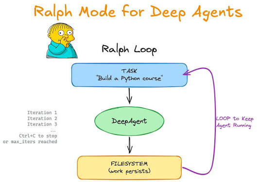

# Ralph Loop with Nemotron 3 Ultra

An autonomous looping agent — the ["Ralph" pattern](https://ghuntley.com/ralph/) — running
[`nvidia/nemotron-3-ultra-550b-a55b`](https://api.together.ai/models/nvidia/nemotron-3-ultra-550b-a55b)
on Together AI via [Deep Agents](https://github.com/langchain-ai/deepagents).

## The pattern



```
while not done:
    fresh_agent(same_task)   # brand-new context window every time
```

Each iteration the agent wakes up with **zero conversation history**, re-orients by
reading the workspace (`ls`, `read_file`), makes incremental progress, and writes
everything back to files. The filesystem is the only memory that survives between
iterations, so context never grows and the loop can run indefinitely — no
summarization or compaction needed. This is the same pattern as
`deepagents/examples/ralph_mode`, reimplemented directly on `create_deep_agent`
with a Together-served open-weight model.

Conventions the agent is prompted to follow:

- `PROGRESS.md` — running state: what's done, what's next (read first each iteration)
- `DONE.md` — written only when the task is fully complete; stops the loop early

## Run it

```bash
export TOGETHER_API_KEY=...

# with uv (dependencies resolve automatically from the script header)
uv run ralph_loop.py "Build a beginner's Python course as markdown files" --iterations 5

# or with pip
pip install "deepagents>=0.6,<0.8" langchain-together
python ralph_loop.py "Build a beginner's Python course as markdown files" --iterations 5
```

Flags: `--iterations N` (default 3; `0` = loop until `DONE.md` or Ctrl+C),
`--work-dir PATH` (default `./ralph_workspace`), `--model` (any
`provider:model` LangChain string — swap in other Together models like
`together:moonshotai/Kimi-K2-Instruct-0905`).

Re-running with the same `--work-dir` resumes where the loop left off — the
workspace, not the process, is the state.

## How it works

`create_deep_agent` gives Nemotron the Deep Agents harness: a planning tool
(`write_todos`), filesystem tools (`ls`, `read_file`, `write_file`, `edit_file`,
`glob`, `grep`), and subagent delegation (`task`). The agent is jailed to the
workspace with `FilesystemBackend(root_dir=work_dir, virtual_mode=True)` — paths
are virtualized under the work dir and traversal outside it is blocked. There is
no checkpointer and no thread reuse: every `agent.invoke()` is a fresh
conversation, which is exactly what Ralph wants.

Shell access is intentionally off (`execute` requires a sandbox backend). If you
want the agent to run commands or use git, swap the backend for
`deepagents.backends.LocalShellBackend` or a remote sandbox.
