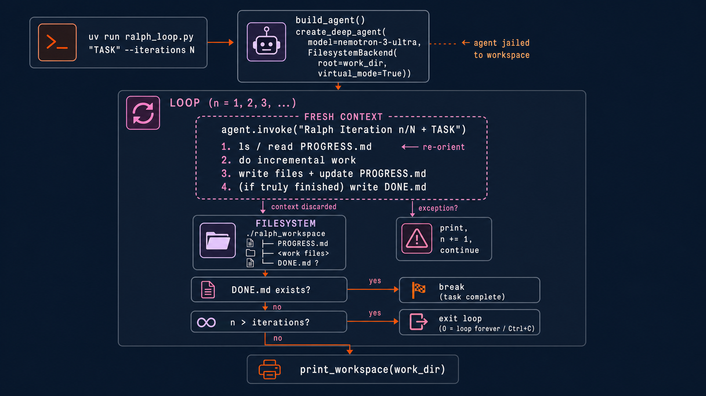

# Ralph Loop with NVIDIA Nemotron 3 Ultra

An autonomous looping agent implementing the ["Ralph" pattern](https://ghuntley.com/ralph/) with
[NVIDIA Nemotron 3 Ultra](https://api.together.ai/models/nvidia/nemotron-3-ultra-550b-a55b),
running on Together AI via [LangChain Deep Agents](https://github.com/langchain-ai/deepagents).

This cookbook demonstrates how to build long-running agents that can make incremental
progress across multiple iterations without growing the context window. It showcases how
LangChain Deep Agents combine planning, tool use, and persistent workspace state to enable
complex, multi-step workflows such as coding, research, and content generation.

## What you'll learn

- How the Ralph pattern turns a single-shot agent into a long-running one: the same task,
  a fresh context window every iteration, and the filesystem as the only memory in between
- How to run an open-weight model (Nemotron 3 Ultra on Together AI) inside the Deep Agents
  harness with `create_deep_agent`
- How to persist and resume agent state through a workspace directory, using simple
  `PROGRESS.md` / `DONE.md` conventions
- How to sandbox an agent's filesystem access with `FilesystemBackend(virtual_mode=True)`,
  and when to swap in a shell-capable backend

## The pattern



```
while not done:
    fresh_agent(same_task)   # brand-new context window every time
```

Each iteration the agent wakes up with **zero conversation history**, re-orients by
reading the workspace (`ls`, `read_file`), makes incremental progress, and writes
everything back to files. The filesystem is the only memory that survives between
iterations, so context never grows and the loop can run indefinitely — no
summarization or compaction needed. This is the same pattern as
`deepagents/examples/ralph_mode`, reimplemented directly on `create_deep_agent`
with a Together-served open-weight model. This pattern is well suited for long-running
tasks that require multiple planning and execution cycles while keeping each model
invocation focused and efficient.

Conventions the agent is prompted to follow:

- `PROGRESS.md` — running state: what's done, what's next (read first each iteration)
- `DONE.md` — written only when the task is fully complete; stops the loop early

This approach is particularly useful for research agents, software engineering, document
generation, and other workloads where tasks naturally evolve over many iterations.

## Run it

```bash
export TOGETHER_API_KEY=...

# with uv (dependencies resolve automatically from the script header)
uv run ralph_loop.py "Build a beginner's Python course as markdown files" --iterations 5

# or with pip
pip install "deepagents>=0.6,<0.8" langchain-together
python ralph_loop.py "Build a beginner's Python course as markdown files" --iterations 5
```

Flags: `--iterations N` (default 3; `0` = loop until `DONE.md` or Ctrl+C),
`--work-dir PATH` (default `./ralph_workspace`), `--model` (any
`provider:model` LangChain string — swap in other Together models like
`together:moonshotai/Kimi-K2-Instruct-0905`).

Re-running with the same `--work-dir` resumes where the loop left off — the
workspace, not the process, is the state.

## How it works

`create_deep_agent` combines the Nemotron 3 Ultra model with the LangChain Deep Agents
harness: a planning tool (`write_todos`), filesystem tools (`ls`, `read_file`, `write_file`,
`edit_file`, `glob`, `grep`), and subagent delegation (`task`). Nemotron 3 Ultra is
particularly well suited for complex agentic workflows that require reasoning, planning,
tool use, and multi-step execution. The agent is sandboxed to the workspace with
`FilesystemBackend(root_dir=work_dir, virtual_mode=True)` — paths are virtualized under
the work dir and traversal outside it is blocked. You can also use OpenShell backend
sandbox as a more robust alternative as well. There is no checkpointer and no thread
reuse: every `agent.invoke()` is a fresh conversation, which is exactly what Ralph wants.

Shell access is intentionally off (`execute` requires a sandbox backend). If you want the
agent to run commands or use git, swap the backend for
`deepagents.backends.LocalShellBackend` or a remote sandbox.

The Ralph pattern provides a reusable foundation for long-running agent workflows where
tasks cannot be completed in a single interaction. You can adapt this approach for coding,
research, data analysis, document generation, or other iterative workflows that benefit
from persistent workspace state and repeated planning.
